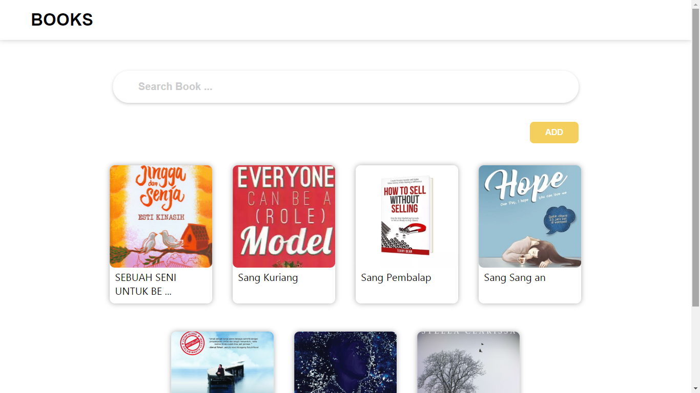

<h1 align="center">Simple Book Management</h1>

  

  Built with React JS  Using State and dummies data

## Table of Contents

- [Features](#features)
- [Requirements](#requirements)
- [Usage](#usage-for-development)
- [Screenshoot](#Screenshoot)
- [Demo](#release-apk)

## Features
* Users can Add, Remove Or delete book
* Search book with title 

## Requirements
* [`npm`](https://www.npmjs.com/get-npm)
* [`react-js`](https://reactjs.org/docs/getting-started.html)

## Usage for development
1. Open your terminal or command prompt
2. Type `git clone https://github.com/zidni0192/react-js-Book-Management.git`
3. Open the folder and type `npm install` for install dependencies 
4. Type `npm start ` for run this app.

## Screenshoot

    
    

## Demo

    <a href="https://reactjs-bookmanagement.netlify.com/">https://reactjs-bookmanagement.netlify.com/</a>

